## Reactive Programming Patterns

### with RxSwift

<BR><BR><BR><BR><BR><BR><BR><BR><BR><BR><BR><BR><BR><BR><BR><BR><BR><BR>
#### Florent Pillet   —  [@fpillet](twitter:fpillet)
#####FrenchKit Conference Paris — September 23rd, 2016


^ Hi everyone, my name is Florent and I'd like to introduce you to the world of reactive programming and RxSwift.

^ Before we begin, let me introduce myself. I worked on many platforms and languages and been doing iOS development since the iPhone native SDK has been available. I'm a freelancer, and I do some opensource development in my spare time.

^ I first discovered reactive programming three years ago with Reactive Cocoa in Objective-C. It was difficult to learn because the framework was not very well documented, and sources of information were scattered all over the net. I kept learning and after a while things clicked for me. Learning Rx was not easy at the time, I think it's easier now thanks to Swift and better documentation as well

^ I'm excited to talk about this technology because it changed the way I think about my code, and I hope I'll be able to pass some of this excitment to you.

---
## Agenda

* Introduction to Rx
* Creating observable sequences
* Basic patterns
* User interface patterns
* Architecture patterns

^ Here is the agenda for today. After a brief introduction to Rx, I'll show you how observable sequences are created. This is one of the things that puzzled me when I first learned Rx, and I'll try to shed some light on it for you.

^ This talk is about programming patterns, or the way we do things and solve problems in Rx.

^ There is a lot of information in this talk. Once the slides are available, you can go back to this presentation and use the slides as a starting point to explore Rx and learn more about it.

^ We'll see basic patterns, some tips about how to wire the user interface, and I'll talk a bit about architecture.

---

## About Rx

* Microsoft Reactive Extensions (Rx.NET) - 2009
* [ReactiveX.io](https://reactivex.io) defines a common API for Rx implementations
* RxSwift 2015
* Shares concepts and API with other implementations
* Heavily tested framework

^ So First a bit of History. rx Became Popular when Microsoft Released the .NET Reactive Extensions In 2009.

^ Since then, many implementations of the same ideas and nearly the same API surfaced for several languages.

^ Some people call it functional reactive programming, or just reactive programming, or just Rx. I like the shorter one.

^ Rx also refers to an API that is common to several languages and platforms. A website named ReactiveX.io groups information and cross-language documentation about the Rx API. This is the main source of documentation I recommend to look into.

^ RxSwift itself appeared early last year. Even though I was using ReactiveCocoa at the time, I chose it for its stability, impressive test rig and the quality of the code.

^ But even though 2009 is the time Rx got mainstream, the concepts of reactive programming have been around us for a very long time.

^ Well, a very *very* long time actually!

---

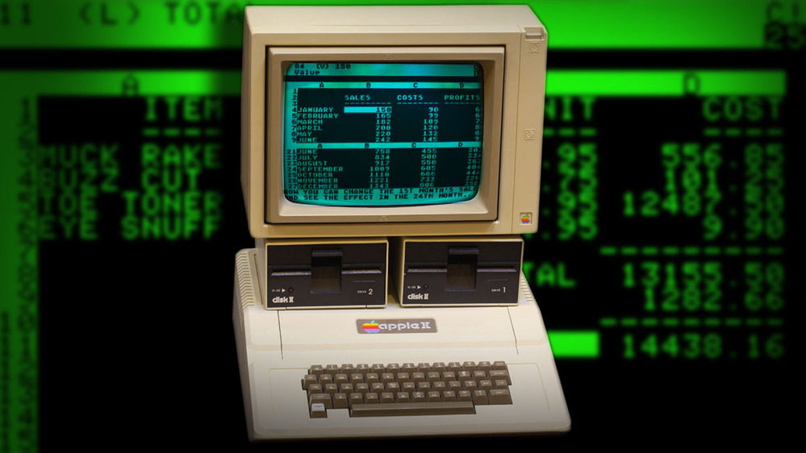

^ Visicalc was the first spreadsheet, released for the Apple Two in 1979

^ Spreadsheets are good example of reactive programming: every time a cell changes in the spreadsheet, all the cells depending on it recalculate their own value.

^ Changes cascade automatically and always the same way. This is why spreadsheets are so useful and valuable: their behavior is completely predictible.

---
### Base concepts

Asynchronous observable **sequences**

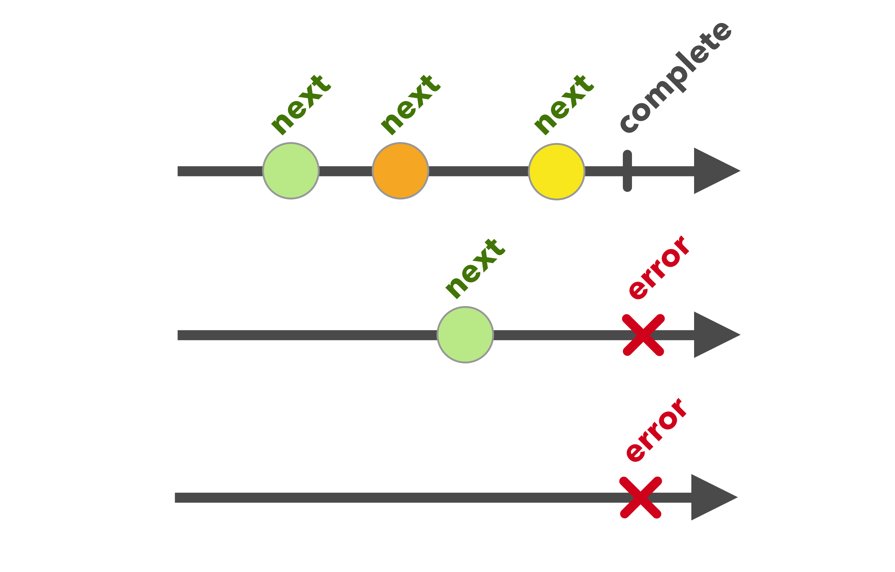

^ So let's dive into the basic ideas in Rx

^ If there is only one thing you remember from this talk, it's that Rx is all about observable sequences.

^ Every bit of data, every event, result of a calculation, of network request, every state change can be represented as an asynchronous sequence.

^ Sequences can deliver zero, one or any number of elements. They can also carry an error, after which they terminate.

---
### Base concepts

* Compose and transform observable sequences using **operators**
* _Rx_ models the **asynchronous propagation of change**

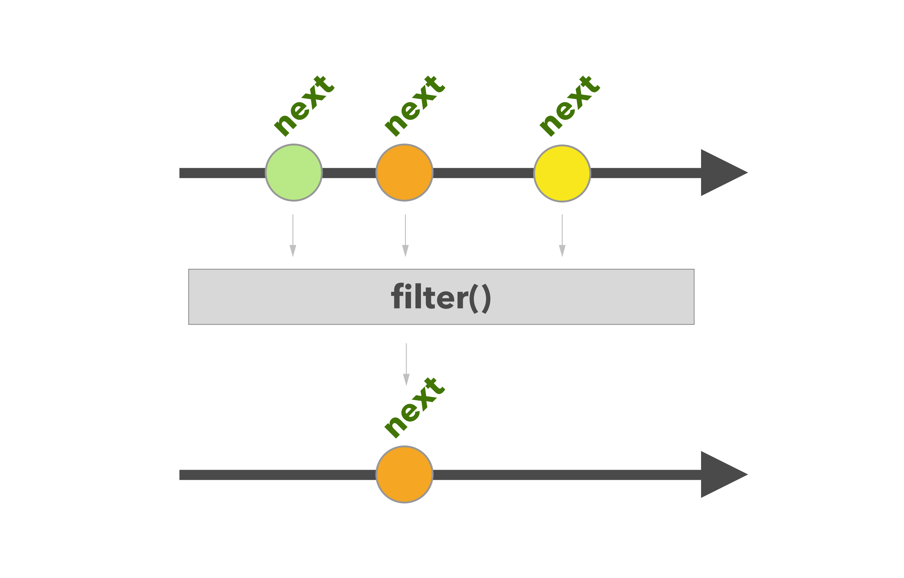

^ The real power of Rx comes when you start composing and transforming sequences

^ You create new sequences by applying operators like the filter operator here

^ Applying the filter operator to a sequence creates a new, filtered sequence that you can further use

^ There is a large number of operators designed to process your data and apply common transformations to it

---

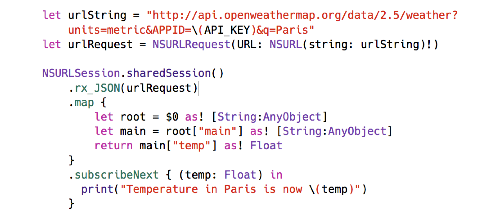

^ Let's have a look at a simple example to see what reactive programming looks like

^ The code you see performs a network request to obtain the current temperature in Paris, using a publicly available API

^ As you can see, the process can be read at once from top to bottom, even though the whole thing occurs asynchronously

---

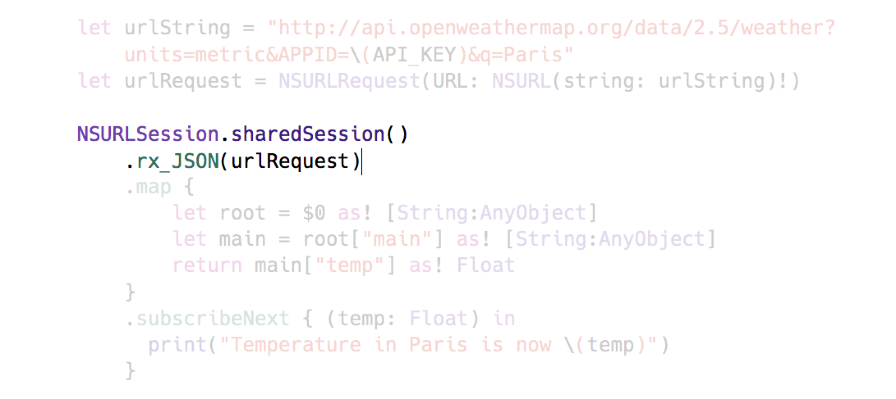

^ So how does this work?

^ We start by using a NSURLSession extension which returns an observable sequence of JSON results

^ When this observable is subscribed to, it fires a network request, waits for a result to come, emits the decoded JSON contents as a single value then completes. This is a "sequence" that outputs at most one element.

^ In case an error happens, the observable sends an error then completes. We will learn more about error handling in a bit. 

---

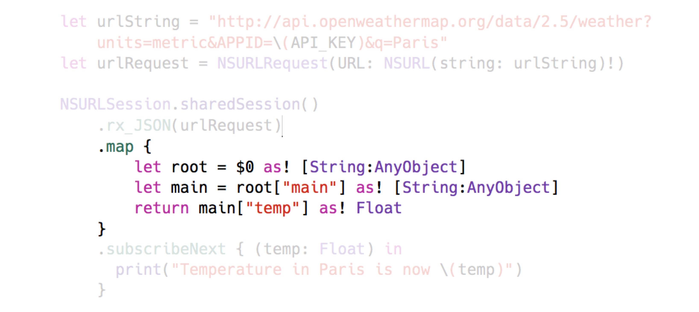

^ When the decoded JSON result is received, we use the map operator to transform it into the data we really want.

^ The map operator works exactly like the one in Swift. The only difference is that it returns a new observable sequence producing elements of the type produced by the closure.

^ So in this case we take an observable producing dictionaries and transform it into an observable producing floats.

^ You'll notice that this is extremely similar to what's you're doing in Swift with map on arrays.

---

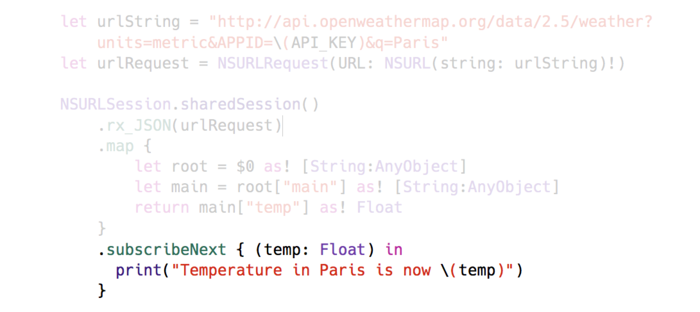

^ Finally we use the `subscribeNext` operator to subscribe to the resulting sequence, the one that `map` produces. When the network requests completes, we receive the temperature and can display it.

^ This example doesn't include error handling nor cancellation. We'll talk about that in a bit.


---
### What did we just see?

* a **sequence** emitted one item then completed,
* the `map` operator **transformed** a sequence of JSON objects into a sequence of Floats,
* similar to Swift sequence mapping but **asynchronous**.

^ Let's recap what we just saw

^ We subscribed to an observable that "does something": in this case trigger a network request, then outputs an element of type float then completes.

^ It's important to understand that there are really two observables involved here: The original observable which sends the network request and emits JSON dictionaries, and the final observable (the one we subscribe to) which emits floats.

^ Like a TCP connection, you must "connect" (subscribe) to the observable to start receiving events.

---
### What did we just see?

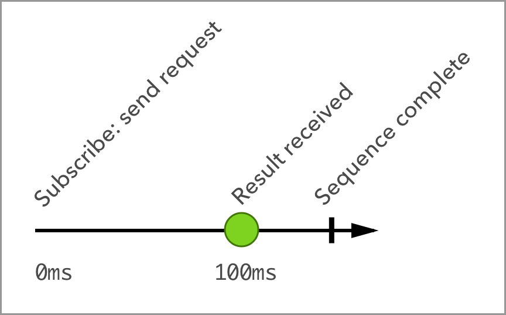

Experiment with interactive marble diagrams<BR>at [rxmarbles.com](https://rxmarbles.com)

^ We can represent the sequence of events as a diagram

^ This is a called a marble diagram because events are represented as marbles on a timeline

^ They are ideal to understand how data flows and how operators transform and produce new sequences

^ The website rxmarbles.com has interactive marble diagrams which are very useful to understand operators. I highly recommend it.

^ You will also see that ReactiveX.io uses marble diagrams to describe each operator.


---
### Observable sequence lifecycle

<BR>

```swift
let disposable = someObservable.subscribe(
	onNext:      { print("value: \($0)") },
	onCompleted: { print("completed")    },
	)
````


^ Now let's talk about the lifecycle of observables

^ An observable can emit zero, one or any number of elements. All elements are of the same type. This is called a NEXT event.

^ There are two types of sequences, finite and infinite.

^ Our network request is an example of a finite sequence. After it has emitted the result of the request, it completes and you'll stop receiving events on this subscription.

^ An example of infinite sequence is a subscription to notifications.

^ The subscribe() method has a number of optional parameters. Here we show handling of NEXT and COMPLETED events.

---
### Observable sequence lifecycle

<BR>
	
```swift
let disposable = someObservable.subscribe(
	onNext:      { print("value: \($0)") },
	onError:     { print("error \($0)")  },
	onCompleted: { print("completed")    }
	)
````


^ In the case an error occurs, an ERROR event is emitted. You can subscribe to receive errors too. After the error, the sequence stops emitting events.

---
### Observable sequence lifecycle

<BR>

```swift
let disposable = someObservable.subscribe(
	onNext:      { print("value: \($0)") },
	onError:     { print("error \($0)")  },
	onCompleted: { print("completed")    },
	onDisposed:  { print("disposed")     }
	)

// at any point, cancel your subscription
// by calling dispose()
	
disposable.dispose()
```


^ You can also optionally be notified when the subscription has been disposed of.

^ This can be convenient for houskeeping but is seldom used.

^ A subscription always returns an object called a Disposable. You can use its dispose() method to dispose the subscription and stop receiving events.

---
### The mysterious genesis of the Observable

^ Now let's talk about one of the things that is the most confusing for newcomers

^ How do you create observables? how do you feed them with data?

^ There are several ways to do this and RxSwift has a rich API for you

---
### The mysterious genesis of the Observable
#### RxCocoa
```swift
import RxCocoa


let disposable = NSNotificationCenter.defaultCenter()
	.rx_notification(UIApplicationSignificantTimeChangeNotification)
	.subscribeNext {
		(notification: UINotification) in
		print("Date changed: time to update!")
	}
```

^ First, a module called RxCocoa is part of RxSwift and provides many extensions to UIKit and AppKit classes. 

^ For example you can easily subscribe to any kind of notification by using the `rx_notification` extension which returns an observable sequence of notifications of the wanted type.

^ From the time you subscribe to the observable, you start receiving the notifications.

^ Use the disposable object to cancel your subscription at any time.

---
### The mysterious genesis of the Observable
#### RxCocoa

```swift
import RxCocoa


@IBOutlet var textField : UITextField!

override func viewDidLoad() {
	super.viewDidLoad()
	let _ = textField.rx_text.subscribeNext {
			(text: String) in
			print("text field changed to \(text)")
	}
}
```

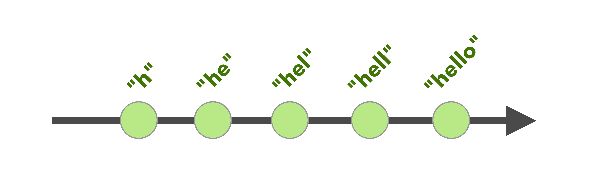

^ In this other example, I use the `rx_text` extension method of UITextField to obtain an observable that will emit a string with the contents of the text field every time it changes.

^ When subscribing to the text field, you receive a first event with the initial contents of the field.

^ Then every time the user types something, you'll receive a new string with the complete contents of the field.

^ Since I ignore the disposable object, this subscription will run until the textfield object is deallocated

---
### The mysterious genesis of the Observable
#### Manual creation

```swift
let strings : Observable<Int> =
	Observable.create { observer in

		observer.onNext("Hello")
		observer.onNext("World")
		observer.onCompleted()

		// we don't need to release any
		// resource on dispose()
		return NopDisposable.instance
	}
```

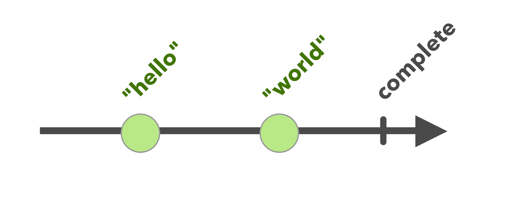

^ You can also create observables manually

^ This example is a very simple sequence that will emit two strings in a row when subscribed to, then complete.

^ Note that every time a new subscriber subscribes, it will receive the same sequence of events.

^ The closure you provide can emit next, complete and error events

^ In addition, it returns the disposable object that gets called when the subscriber cancels its subscription, or your sequence naturally completes.

^ Here we don't need to perform any cleanup so we just return a `NopDisposable`

---
### The mysterious genesis of the Observable
#### Manual creation

```swift
let asyncComputation : Observable<Data> =
	Observable.create { observer in
		let task = someAsyncTask()
		task.run(
			success: {
				(result: Data) in
				observer.onNext(result)
				observer.onCompleted()
			}
			error:  {
				(error: ErrorType) in
				observer.onError(error)
			}
		)
		return AnonymousDisposable {
			task.cancel()
		}
	}
```

^ Here is a more complex example of an observable with asynchronous computation

^ When you subscribe to the observable, it starts computing something asynchronously

^ When the task is done and successful, we emit an event with the data result, then we indicate that the sequence is complete

^ If the task reports an error, we emit an error event. This stops the sequence, we can't emit any more events after that

^ Finally at completion time, or when the subscription is disposed before our task completes, our disposable gets called. Here, we use an AnonymousDisposable which executes its closure on dispose(). We cancel the task at this point, in case it was still running.

^ Again, every time you subscribe to this observable, a new task is started. If you want to create an observable that performs the work only once, RxSwift provides operators allowing you to share a single subscription and replay the results.

---
### The mysterious genesis of the Observable

More ways to obtain observables:

* Items from an array or collection
* `DelegateProxy`
* `rx_observe(type, keypath, options)`
* `rx_sentMessage(#selector)`
* `Subject` (*stateless*) and `Variable` (*stateful*)

^ There are many other ways to lift data and events to observable sequences

^ We don't have enough time to review them all now, but you can use this list as a starting point to explore the rich API of RxSwift

^ RxCocoa provides a number of reactive interfaces to UI classes with delegates, like UITableView and UICollectionView. DelegateProxy is the backbone class that allows this, and you can use it in areas not yet covered by RxCocoa.

^ rx_observe is for KVO, rx_sentMessage swizzles selectors.

^ One quick note about Subject and Variable, they are observables you can feed manually. Every time you feed them a new value, a Next event is emitted to all subscribers. It's a convenient way to get started with observable sequences.

---
# Basic Patterns

^ Now lets see how Rx helps you solve programming problems

^ We'll take some basic tasks and implement a solution with RxSwift

---
### Composition
#### Task: update temperature label when button tapped

```swift
func getTemperature(city: String)
	-> Observable<(String,Float)>

func formattedTemperature(temp: Float)
	-> String

let disposable = button.rx_tap
	.withLatestFrom(textField.rx_text)
	.flatMapLatest {
		(city: String) -> Observable<(String,Float)> in
		return getTemperature(city)
	}
	.subscribeNext {
		(temp: (String,Float)) in
		let degrees = formattedTemperature(temp.1)
		label.text = "It's \(degrees) in \(temp.0)"
	}
```

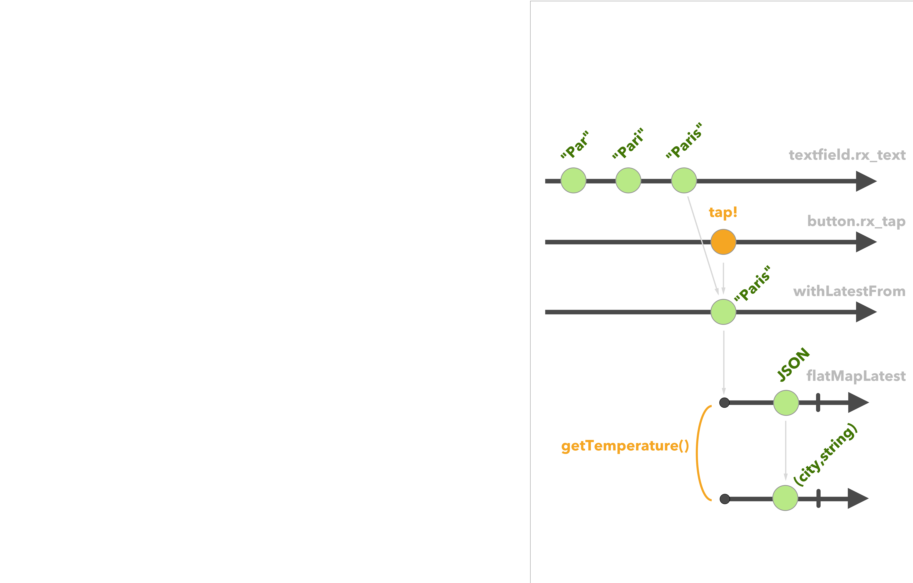

^ Our first task is to let a user type a city name then press a button to obtain the current temperature.

^ We need to connect a button and a text field to a network request, then feed the result to a label.

^ To do this, we'll use composition of multiple observables

^ First, we use the `rx_tap` extension method of UIButton to observe button taps

^ Next, we compose taps using the `withLatestFrom` operator

^ Every time the button is tapped, `withLatestFrom` emits the latest value received from the textfield. It's like a filtered view on the textfield

^ Then, we use flatmap to subscribe to a new network request every time we receive a string

^ `flatMap` subscribes to the observable and relays its events.

^ Finally, we subscribe to the resulting observable which delivers temperature updates every time the user presses the button

^ There'S a lot going on here. We linearly described a series of actions and composes multiple sources to obtain the desired result

^ Once you get comfortable with Rx, you'll appreciate how powerful this can be. You can express program logic in a few steps that make the whole code easy to read.

---
### Aggregation
#### Task: obtain the current temperature in multiple cities

```swift

let disposable = ["Berlin","London",
				  "Madrid","Paris",
				  "Rome"]
	.map { 
		(city: String) -> Observable<(String,Float)> in
		return getTemperature(city)
	}
	.toObservable()
	.merge()
	.toArray()
	.subscribeNext {
		(temperatures: [(String,Float)]) in
		// we get the result of the five requests
		// at once in a nice array!
	}
```

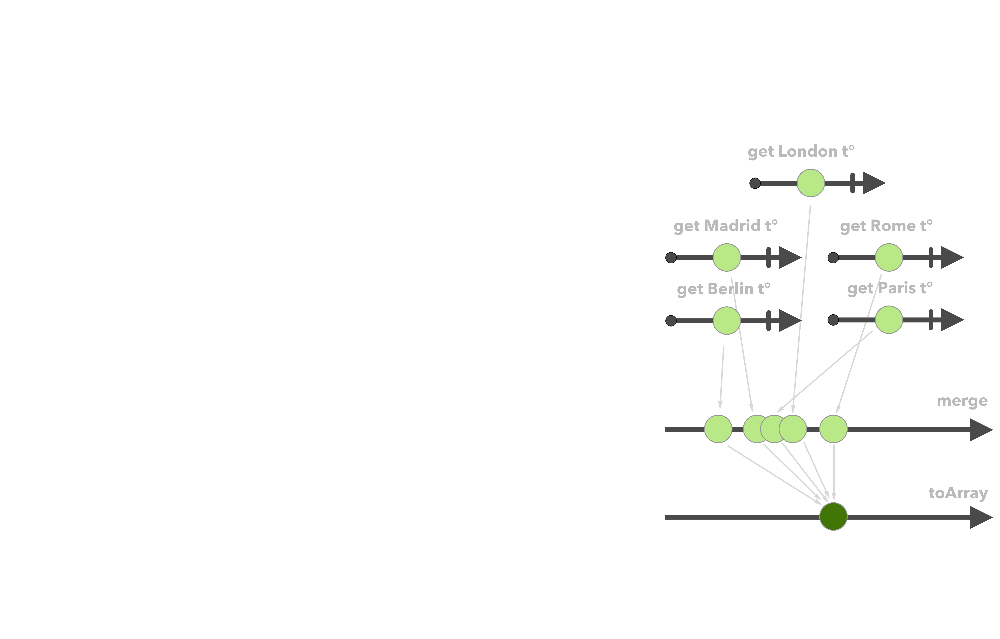

^ Our next pattern is aggregation.

^ We want to get the temperature in multiple cities and turn it into a single array once all the results come in

^ It'S easy to do with Rx. We first take each city name and make an array of observables that will trigger one network request per city

^ Next, we merge all these observables into a single sequence which delivers each result as they come in

^ Once all the results have been obtained, the observable will complete

^ We use the toArray() operator to group all the values received into a single array. toArray() waits for completion then emits an array of all the values

^ Finally when we subscribe to this, it starts all the requests then after a while sends us a nice array with all the temperatures

---
### Cancellation
#### Task: update temperature every second until VC disappears

```swift
var timerDisposable : Disposable!

override func viewWillAppear(animated: Bool) {
	super.viewWillAppear(animated)
	timerDisposable = Observable
		.timer(0.0, period: 60.0, scheduler: MainScheduler.instance)
		.flatMap { _ -> Observable<String> in
			getTemperature("Paris").map {
				(temp: (String,Float)) -> String in
				return String(temp.1)
			}
		}
		.bindTo(label.rx_text)
}

override func viewWillDisappear(animated: Bool) {
	timerDisposable.dispose()
	super.viewWillDisappear(animated)
}
```

^ Our next pattern is cancellation

^ Most of the time, you'll want to be able to cancel subscriptions to observables

^ Let's take an example. We want the temperature in paris to be queried and updated every minute while the view controller is on screen

^ To do this, we create an observable timer that will emit a value at the selected interval

^ We just discard the value, flatmap it to an observable that queries the temperature

^ Then we bind the resulting observable to our label

^ When the view controller goes offscreen, we simply dispose() our timer subscription and we're done!

---
### Error handling
#### Task: if a temperature network request fails, display `"--"`

```swift
func getTemperatureAsString(city: String) -> Observable<(String,String)> {
	return getTemperature(city)
		.map {
			(temp: (String,Float)) -> String in
			return (city, formattedTemperature(temp.1))
		}
		.catchErrorJustReturn((city, "--"))
}
```

^ Now you may have noticed that we never handled errors in previous examples.

^ Let'S see how we can improve this.

^ Network requests can fail for many reasons. If we fail to get a temperature, we want to display a couple dashes.

^ For this we first create a function to transforms the returned value of the request into a tuple containing both: the city, and the temperature as a string

^ We use the `catchErrorJustReturn` operator, which returns a specific value in the case the observable emits an error. 

---
### Error handling
#### Task: if a temperature network request fails, display `"--"`

```swift
let disposable = button.rx_tap
	.withLatestFrom(textField.rx_text)
	.flatMapLatest {
		(city: String) -> Observable<(String,String)> in
		return getTemperatureAsString(city)
	}
	.map {
		(temp: (String,String)) -> String in
		return "It's \(temp.1) in \(temp.0)"
	}
	.bindTo(label.rx_text)
```

^ We can now use this improved observable to feed a temperature update to our label

^ We are now confident that if the network fails on us, the user won't see an outdated temperature.

^ We also further transform the request result into a readable string that we feed to the label using the `bindTo` operator.

^ bindTo is like subscribe(), excepts that it feeds NEXT elements into the given observer.

^ The rx_text property of a label is an observer: it can receive new values!

---
# User interface patterns

^ This takes us to the next stage of our RxSwift exploration: User Interface binding patterns

---
### Driver

```swift
let disposable = button.rx_tap
	.withLatestFrom(textField.rx_text)
	.flatMapLatest {
		(city: String) -> Driver<String> in
		return getTemperature(city)
			.map { formattedTemperature($0.1) }
			.asDriver(onErrorJustReturn: "--")
	}
	.drive(label.rx_text)
```

^ In previous examples we didn't care about threading

^ But network operations most often run in the background

^ So we obviously want to update the UI on the main thread

^ Also, we want to guarantee that UI bindings will never fail on error. If they do once, the connection is lost and a UI element may not update anymore.

^ RxSwift has provisions for this. The Driver unit is a special object that works like a smarter observable.

^ It guarantees delivery on the main thread, and never fails. If an error occurs, it can emit a template value or take other action.

^ Driver is ideal for driving the UI

^ Here we turn the temperature observable into a driver that guarantees delivery on the main thread, and provides a default value in the case the network request fails.

---
### Action

* not technically part of RxSwift
* an important pattern for binding the UI
* `pod Action`
* a very useful pattern for MVVM

^ The next UI pattern I want to talk about is Action.

^ It's not technically part of RxSwift, but it's a very useful tool you can use to bind the UI.

^ Action is a way to trigger actions from the user interface in a generic way

^ It can "lock" the UI (for example prevent multiple taps on a button) while the previous action has not finished executing.

^ It's a very useful pattern if your doing MVVM, because it decouples the actual logic from the view controller

---
### Action

```swift
import Action

lazy var getTemperatureAction : CocoaAction = CocoaAction {
	[unowned self] in
	return self.getTemperatureAsString(self.textfield.text)
}

button.rx_action = getTemperatureAction
getTemperatureAction.elements.bindTo(label.rx_text)
```

^ Let's look at a simple example. I grouped everything in the view controller to make things more readable

^ We still have our button to get the temperature, a textfield where we enter the city name, and a label to display the result

^ We'RE going to wire them up a bit differently, for fun

^ Our action, when executed, obtains the latest string from the textfield (in a non-reactive way) then returns a network request observable. Until this observable completes, the button will stay locked and no further action will be executed

^ Action also exposes an observable sequence of all the elements emitted by successive invocations, so we simply bind this observable to our label

^ And we're done! every time we press the button, the action executes, the network request fires and output a temperature that gets fed into the label

^ As you can see this process is a bit different from what we saw before. Action has many more uses I can't cover it, it's a very useful tool to have in your toolbox!

---
# Architecture patterns

^ To conclude this roundup, let's talk about some application architecture patterns

---
# Architecture patterns

* Expose all data to display as Observable sequences
* Use Action to wire up the UI whenever possible
* MVVM is a perfect fit for Rx

^ You generally want to expose all your data through observables

^ Use the Action pattern to wire up the UI whenever possible

^ MVVM is a pattern that really works well if you are using Rx


---
# Architecture patterns

* Decouple application logic from application _infrastructure_
* Storage, geolocation, network requests, image cache etc. are a good fit for insulation
* Makes replacing whole parts of the app easier
* Testing and mocking are easier too

^ Going further, you'll want to decouple your application logic from the infrastructure that supports it

^ By infrastructure, I mean everything that's not relevant to individual screens in your app.

^ This can be storage in a database, network requests, image cache, geolocation and so on

^ Again, a key way to decouple parts of your application is to use observables to obtain data

^ For example, a database query that lists items can return an observable of a result array

^ This way, when a database update occurs somewhere else, subscribers of this observable can be automagically updated


---
# Summary

---
## Reactive programming

* Powerful way to express program logic
* Model the asynchronous propagation of change
* Eliminate state from your code
* Code is more testable
* RxSwift is a solid foundation
* Fast growing pool of users, add-ons and contributors ([RxSwiftCommunity](https://github.com/RxSwiftCommunity)!)

---
## Links

* RxSwift source [github.com/reactivex/rxswift](https://github.com/reactivex/rxswift)
* Community projects [github.com/RxSwiftCommunity](https://github.com/RxSwiftCommunity)
* Artsy's Eidolon app [github.com/artsy/eidolon](https://github.com/artsy/eidolon)
* ReactiveX website [reactivex.io](https://reactivex.io)
* RxMarbles [rxmarbles.com](http://rxmarbles.com)

---
# Q & A